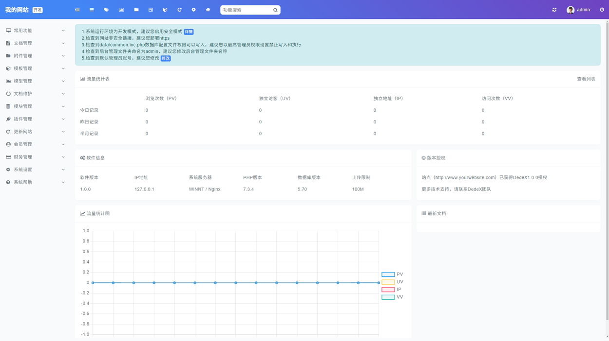

## DedeX

DedeX系统基于PHP7开发，具有高度可扩展性，并根据GPLv2协议开源。除了支持流行的Go语言进行开发外，还具备简单易用、灵活扩展以及更高的安全性和效率。该系统的模板设计简便，延续了以往的标签系统，同时引入了响应式模板引擎Bootstrap，简化了跨终端和移动端全媒体站点的搭建过程。

## 版本说明

DedeX1.x是一个LTS版本，支持将到2035年11月截止，目前DedeX已经发布，可以[点击下载](https://codeload.github.com/xushubieli/DedeX/zip/refs/heads/main)获取



## 参与开源

访问[代码托管](https://github.com/xushubieli/DedeX.git)，可以通过提交Pull requests的方式来贡献您的力量

## v2.0 Roadmap

我们将会收集、整理新的功能需求制定新的Roadmap

在这里，可以查看版本[更新记录](docs/changelog.md)

## 平台需求

1.Windows 平台

IIS/Apache/Nginx + PHP7/PHP8 + MySQL5/8/10

2.Linux/Unix 平台

Apache/Nginx + PHP7/PHP8 + MySQL5/8/10 (PHP必须在非安全模式下运行)

建议使用平台：Linux + Apache2.4 + PHP8.4 + MySQL8.0

3.PHP必须环境或启用的系统函数

Fileinfo：文件上传安全校验

GD扩展库：图像验证码、水印、二维码生成

MySQL扩展库：数据存储

4.基本目录结构及文件

```
./docs              文档及协议
./src               系统源代码
..|_/a              默认网页文件存放目录[必须可写入]
..|_/admin          默认后台管理目录[可任意改名]
..|_/apps           插件扩展程序目录[不可写入，可执行]
..|_/data           系统缓存或其它可写入数据存放目录[必须可写入，但不可执行，建议关闭对外访问权限]
..|_/install        程序安装目录，安装完后可删除[安装时必须有可写入权限]
..|_/static         静态资源存放目录[必须可写入，无需执行]
..|_/system         类库文件目录[建议关闭对外访问权限]
..|_/theme          系统默认内核模板目录[建议关闭对外访问权限]
..|_/user           会员目录
..|_/index.php      入口文件
..|_/license.txt    GPLv2开源许可协议
./tools             系统工具
..|_/resetpwd.php   管理员密码修改工具（如需重置放至站点根目录，用完删除）
```

5.PHP环境容易碰到的不兼容性问题

  * data目录没写入权限，导致系统session无法使用，这将导致无法登录管理后台（直接表现为验证码不能正常显示）；

  * php的上传的临时文件夹没设置好或没写入权限，这会导致文件上传的功能无法使用；
  
  * 出现莫名的错误，如安装时显示空白，这样能是由于系统没装载mysql扩展导致的，对于初级用户，建议采用命令行工具来运行测试站点；

## 程序安装使用

1.下载程序解压到本地目录;

2.上传程序目录中的`/src`到网站根目录；

3.运行`http://www.yourwebsite.com/install/index.php`（yourwebsite.com）表示您的站点，按照安装说明进行程序安装；

## 版权信息

详细参考：[DedeX站点授权协议](/LICENSE)

DedeX 系统严格遵循 GPLv2 国际开源标准，全力打造纯粹的开源环境，开发者可自由使用、修改与分发代码，畅享开源带来的无限可能。

## 相关资源

- [代码托管](https://github.com/xushubieli/DedeX.git)

- 邮箱：xushubieli@qq.com